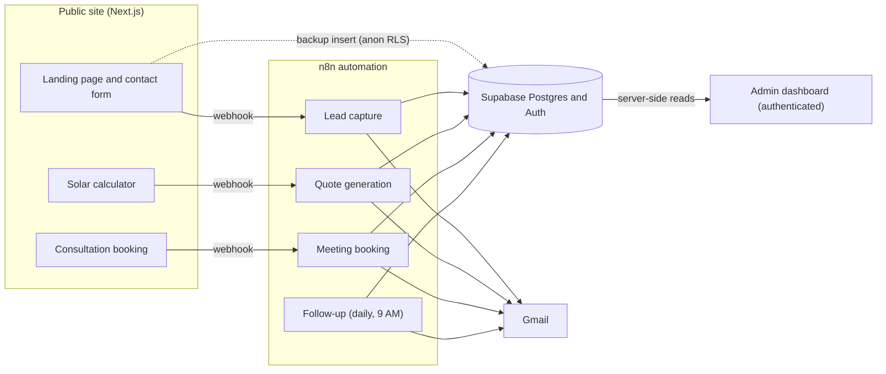
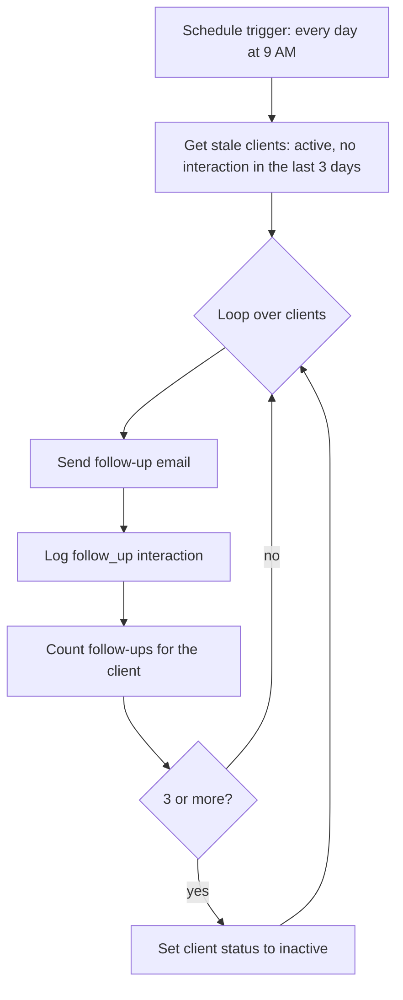
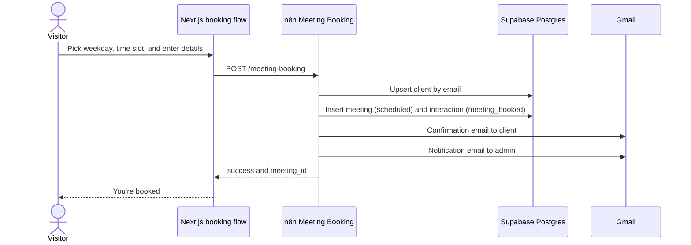
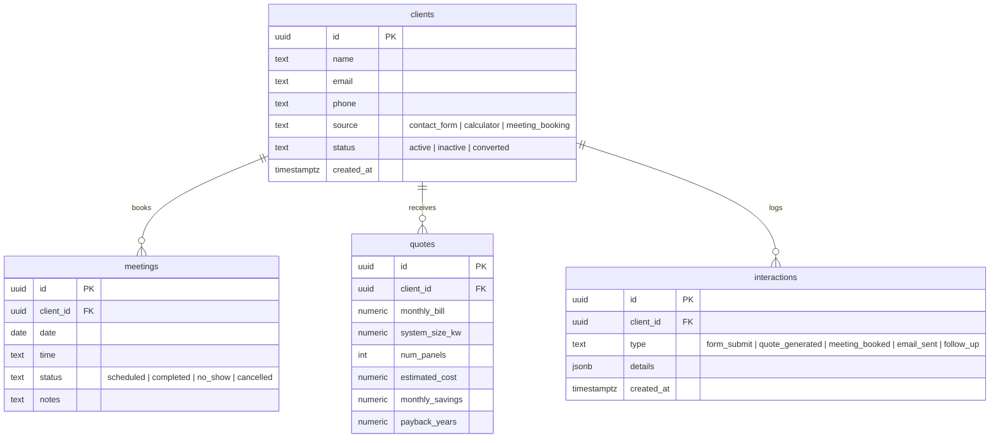

# Solaris Energy CRM

**A solar lead-to-consultation funnel with an n8n automation layer, a Supabase-backed CRM, and an authenticated admin dashboard.**

Visitors size a solar system, request a quote, and book a consultation. n8n captures every lead, calculates and emails quotes, confirms bookings, and follows up automatically. The business team then runs the whole pipeline from one dashboard.

**[Watch the product demo](https://youtu.be/KvBplrA9QAg)**

| | |
| --- | --- |
| **Frontend** | Next.js 16 (App Router), React 19, TypeScript, Tailwind CSS 4 |
| **Automation** | n8n (webhooks, scheduled trigger, Postgres, Gmail, Code nodes) |
| **Data and auth** | Supabase PostgreSQL, Row Level Security, Supabase Auth (`@supabase/ssr`) |
| **Status** | Working demo of the product and integration architecture |

## Contents

- [Results](#results)
- [How it works](#how-it-works)
- [Automation layer (n8n)](#automation-layer-n8n)
- [Admin dashboard](#admin-dashboard)
- [Data model and security](#data-model-and-security)
- [Design decisions](#design-decisions)
- [Project structure](#project-structure)
- [Getting started](#getting-started)
- [Known limitations and roadmap](#known-limitations-and-roadmap)

## Results

Automation results from the first week of running the n8n workflows (demo environment):

| Metric | Result |
| --- | --- |
| Leads scheduled for consultations by the n8n booking automation | **16** |
| Follow-up emails sent automatically to potential clients | **14** |

Every booking and follow-up runs without manual work and is logged as an interaction, so each touchpoint is visible in the CRM.

## How it works



1. **Attract:** a responsive marketing site (services, testimonials, contact form) captures leads.
2. **Estimate:** the calculator turns monthly bill, usage, roof area, and city into system size, panel count, cost, savings, payback, and CO2 offset instantly in the browser.
3. **Quote:** a visitor can request a detailed quote. n8n recalculates it, stores it, emails it, and returns it to the UI.
4. **Book:** visitors pick one of the next 30 weekdays and one of eight hourly slots (09:00 to 16:00). n8n creates the meeting and emails both the client and the admin.
5. **Nurture:** a daily n8n schedule re-engages quiet clients and deactivates the ones who never respond.
6. **Operate:** the admin dashboard shows KPIs, lead trends, client histories, and meeting outcomes.

## Automation layer (n8n)

Two workflow exports live in the repo, so the automation layer is inspectable and portable:

| File | n8n workflow | Contents |
| --- | --- | --- |
| [`Workflow1.json`](Workflow1.json) | `Solar_Company_1` (29 nodes) | Quote generation, meeting booking, daily follow-up, dashboard data |
| [`Workflow 2.json`](Workflow%202.json) | `Solar _Company_2` (6 nodes) | Lead capture |

| Automation | Trigger | What it does | Database writes | Emails |
| --- | --- | --- | --- | --- |
| **Lead capture** | `POST /lead-capture` | Inserts the client, logs a `form_submit` interaction | `clients`, `interactions` | Thank-you to the lead, alert to admin |
| **Quote generation** | `POST /quote-generation` | Calculates the quote in a Code node, upserts the client by email, stores the quote, logs `quote_generated` | `clients`, `quotes`, `interactions` | Itemized quote to the visitor |
| **Meeting booking** | `POST /meeting-booking` | Upserts the client by email, inserts the meeting as `scheduled`, logs `meeting_booked` | `clients`, `meetings`, `interactions` | Confirmation to the client, alert to admin |
| **Follow-up** | Schedule, every day at 09:00 | Finds stale clients, emails them, logs the follow-up, deactivates after 3 | `interactions`, `clients` | "We miss you" nudge |
| **Dashboard data** | Webhook `dashboard-data` | Runs four aggregate queries and returns JSON (not used by the app, see [Design decisions](#design-decisions)) | none | none |

### Webhook contracts

```jsonc
// POST /lead-capture       (contact form)
{ "name": "Jane Doe", "email": "jane@company.com", "phone": "+923001234567", "message": "..." }
// -> { "success": true, "message": "Lead captured" }

// POST /quote-generation   (calculator + quote form)
{ "name": "...", "email": "...", "phone": "...", "monthly_bill": 45000, "usage_kwh": 600, "roof_area": 900, "city": "Lahore" }
// -> { "success": true, "quote": { "system_size_kw", "num_panels", "estimated_cost", "monthly_savings", "payback_years" } }

// POST /meeting-booking    (booking flow)
{ "name": "...", "email": "...", "phone": "...", "date": "2026-08-24", "time": "14:00", "notes": "..." }
// -> { "success": true, "meeting_id": "<uuid>", "message": "Meeting scheduled" }
```

### Follow-up logic



Because each follow-up is logged as an interaction, a client is only "stale" again after another 3 quiet days. After the third follow-up the client is set to `inactive`, which keeps the daily run from emailing people forever.

### Booking flow



### Quote math

The calculator (`lib/solar-calc.ts`) and the n8n `Calculate Quote` node use the same model, so the instant estimate and the emailed quote agree:

```text
system size (kW) = monthly kWh / (30 days x 4.5 peak sun hours)
panel count      = ceil(system size / 0.55 kW per panel)
estimated cost   = system size x PKR 170,000 per kW
monthly savings  = monthly bill x 0.85
payback (years)  = estimated cost / (monthly savings x 12)
CO2 offset       = system size x 4.5 x 365 x 0.65 kg / 1000   (tons per year, browser only)
```

## Admin dashboard

An authenticated, server-rendered dashboard at `/admin`. Every page reads Supabase directly through the signed-in user's session.

| Page | What it shows |
| --- | --- |
| **Overview** | Four KPI cards (total clients, meetings this week, active clients with inactive count, quotes generated) with period-over-period trends: clients and quotes month over month, meetings week over week. A six-month lead trend chart and the six most recent interactions. |
| **Clients** | Searchable, status-filterable table sortable by name, status, or created date. Clicking a row expands the client's meetings, interactions, and quotes. |
| **Meetings** | Search by name or email, filter by status, and update a meeting to `completed`, `no_show`, or `cancelled` through an authenticated Server Action that revalidates the affected pages. |
| **Agents** | One card per automation (Lead Capture, Quote Generator, Meeting Booker, Follow-up) with the time it last triggered, derived from `interactions`. When configured, each card links to the workflow in the n8n editor. |

The UI also includes loading skeletons (overview, clients, meetings), empty states, inline error states, and a responsive layout. `/admin` itself renders the login form when there is no session, while nested admin routes redirect to it.

## Data model and security



### Row Level Security

Policies live in [`supabase/policies.sql`](supabase/policies.sql) so they are version controlled and reproducible.

| Role | `clients` | `meetings` | `interactions` | `quotes` |
| --- | --- | --- | --- | --- |
| `anon` (public visitors) | insert only | insert only | insert only | no access |
| `authenticated` (admin) | full access | full access | full access | full access |

- Anonymous visitors can never read client data, so no PII is exposed.
- Quotes are not writable by visitors. Quote creation belongs to n8n.
- `/admin/*` sub-routes are protected in `middleware.ts`, which also refreshes the Supabase session cookie on every request. Unauthenticated requests are redirected to the login screen.
- The meeting status Server Action re-checks authentication before it mutates anything.
- The service-role client is isolated in `lib/supabase/admin.ts` behind `server-only`, so it cannot be imported into a Client Component.

## Design decisions

| Decision | Reasoning |
| --- | --- |
| **Dashboard reads Supabase directly instead of the n8n `dashboard-data` webhook** | The webhook only re-reads the same tables and consistently took about 7 to 8 seconds. Direct server-side reads are much faster and need no extra secrets in the browser. |
| **n8n owns the whole booking write path** | A direct browser insert next to n8n's upsert would risk duplicate client records, so the booking form only calls the webhook. |
| **Client-generated UUIDs for the contact form backup insert** | `INSERT ... RETURNING` needs a SELECT policy, which anonymous users intentionally do not have. The app generates the id with `crypto.randomUUID()` instead of reading it back. |
| **Fail-soft webhook client (`lib/webhook.ts`)** | `postToWebhook` never throws into the UI. It returns `{ ok, data }`, treats an explicit `success: false` as failure even on HTTP 200, and lets the site run in local or demo environments before n8n is wired up. |
| **Contact form writes to both n8n and Supabase** | The lead is never lost if the workflow is down. |
| **No n8n REST control plane** | The n8n API needs a paid plan. The Agents page links out to the editor and leaves activation to n8n itself. |
| **RLS policies documented in SQL** | Tables with RLS enabled and zero policies deny everything. Public inserts fail with a 401, and admin reads silently return empty results because RLS filters SELECT rows instead of raising an error. The policy file makes that failure mode reproducible. |
| **Typed domain model (`lib/types.ts`)** | Enums mirror the database `check` constraints, and joined shapes (`ClientWithRelations`, `MeetingWithClient`) keep the admin pages type-safe. |

## Project structure

```text
.
├── app/
│   ├── (public)/                 Landing page (page.tsx), calculator/, book/
│   ├── (admin)/admin/            Overview (page.tsx), clients/, meetings/, agents/, with loading states
│   ├── layout.tsx                Root layout and metadata
│   ├── globals.css               Tailwind and theme styles
│   └── favicon.ico
├── components/
│   ├── site/                     Header, Footer, Logo, ContactForm
│   ├── calculator/               CalculatorForm, QuoteRequestForm, StatCard
│   ├── booking/                  BookingFlow, Calendar, TimeSlotGrid
│   ├── admin/                    Sidebar, Topbar, StatCard, LeadTrendChart, RecentActivity,
│   │                             ClientsTable, MeetingsTable, AgentCard, LoginForm, Skeleton
│   └── ui/                       Button, Card, Badge, Field, Container, IconTile, icons
├── lib/
│   ├── solar-calc.ts             Pure sizing and cost calculations
│   ├── webhook.ts                Fail-soft n8n webhook client
│   ├── n8n.ts                    Workflow editor link helpers (server-only)
│   ├── types.ts                  CRM domain types
│   ├── utils.ts                  Dates, time slots, formatting, class helpers
│   ├── actions/meetings.ts       Authenticated Server Action
│   └── supabase/                 client.ts, server.ts, middleware.ts, admin.ts, auth.ts
├── public/images/                residential-install.jpg, rooftop-sunset.jpg, solar-field.jpg
├── supabase/policies.sql         Row Level Security policies
├── Workflow1.json                n8n: quote, booking, follow-up, dashboard data
├── Workflow 2.json               n8n: lead capture
├── middleware.ts                 Session refresh and /admin protection
├── .env.example                  Environment variable template
├── package.json                  Scripts and dependencies
├── next.config.ts, tsconfig.json, eslint.config.mjs, postcss.config.mjs
├── AGENTS.md, CLAUDE.md          Instructions for AI coding assistants
└── README.md
```

## Getting started

### Prerequisites

- Node.js compatible with the Next.js 16 toolchain
- A Supabase project (PostgreSQL and Auth)
- An n8n instance with a Postgres credential (your Supabase connection) and a Gmail credential

### 1. Install and configure

```bash
git clone https://github.com/MUnssRahim/SolarCompany-CRM-n8n-Automation.git
cd SolarCompany-CRM-n8n-Automation
npm install
cp .env.example .env.local
```

| Variable | Purpose |
| --- | --- |
| `NEXT_PUBLIC_SUPABASE_URL` | Supabase project URL |
| `NEXT_PUBLIC_SUPABASE_ANON_KEY` | Session-scoped browser and server access |
| `SUPABASE_SERVICE_ROLE_KEY` | Server-only privileged client, never expose it to the browser |
| `NEXT_PUBLIC_N8N_LEAD_WEBHOOK` | Lead capture production webhook URL |
| `NEXT_PUBLIC_N8N_QUOTE_WEBHOOK` | Quote generation production webhook URL |
| `NEXT_PUBLIC_N8N_MEETING_WEBHOOK` | Meeting booking production webhook URL |
| `NEXT_PUBLIC_N8N_DASHBOARD_WEBHOOK` | Reserved. The dashboard reads Supabase directly |
| `N8N_BASE_URL` | Used only to build "View workflow in n8n" links |
| `N8N_WORKFLOW_ID_LEAD_CAPTURE` / `_QUOTE_GENERATION` / `_MEETING_BOOKING` / `_FOLLOW_UP` | Workflow IDs for the Agents page links |
| `N8N_API_KEY` | Unused (the n8n REST API needs a paid plan) |

### 2. Set up Supabase

1. Create the four tables (`clients`, `meetings`, `quotes`, `interactions`). A reference schema is below.
2. Apply [`supabase/policies.sql`](supabase/policies.sql).
3. In **Authentication**, create the first admin user with email and password and auto-confirm enabled.

<details>
<summary>Reference schema (reconstructed from the app types and workflow queries)</summary>

```sql
create table public.clients (
  id uuid primary key default gen_random_uuid(),
  name text not null,
  email text not null,
  phone text,
  source text not null default 'contact_form'
    check (source in ('contact_form', 'calculator', 'meeting_booking')),
  status text not null default 'active'
    check (status in ('active', 'inactive', 'converted')),
  created_at timestamptz not null default now()
);

create table public.meetings (
  id uuid primary key default gen_random_uuid(),
  client_id uuid not null references public.clients(id) on delete cascade,
  date date not null,
  time text not null,
  status text not null default 'scheduled'
    check (status in ('scheduled', 'completed', 'no_show', 'cancelled')),
  notes text,
  created_at timestamptz not null default now()
);

create table public.quotes (
  id uuid primary key default gen_random_uuid(),
  client_id uuid not null references public.clients(id) on delete cascade,
  monthly_bill numeric,
  system_size_kw numeric,
  num_panels integer,
  estimated_cost numeric,
  monthly_savings numeric,
  payback_years numeric,
  created_at timestamptz not null default now()
);

create table public.interactions (
  id uuid primary key default gen_random_uuid(),
  client_id uuid references public.clients(id) on delete cascade,
  type text not null
    check (type in ('form_submit', 'quote_generated', 'meeting_booked', 'email_sent', 'follow_up')),
  details jsonb,
  created_at timestamptz not null default now()
);

alter table public.clients enable row level security;
alter table public.meetings enable row level security;
alter table public.quotes enable row level security;
alter table public.interactions enable row level security;
```

</details>

### 3. Import the n8n workflows

1. In n8n, import `Workflow1.json` and `Workflow 2.json`.
2. Attach your **Postgres** (Supabase) and **Gmail** credentials to the Postgres and Gmail nodes.
3. Replace the placeholder admin address in the `Email Admin` nodes.
4. **Activate** both workflows and copy each **production** webhook URL (`/webhook/...`, not `/webhook-test/...`) into `.env.local`.

### 4. Run

```bash
npm run dev       # http://localhost:3000
npm run lint      # ESLint
npm run build     # production build
npm run start     # serve the production build
```

Public site: `/`, `/calculator`, `/book`. Admin: `/admin` (sign in with the user you created).

## Known limitations and roadmap

This repository is a working demo of the product and integration architecture. Production hardening would add:

- Server-side webhook mediation or signature validation, plus rate limiting, instead of public webhook URLs in `NEXT_PUBLIC_*` variables.
- Real availability checks against calendar data (today all eight slots are always offered) and calendar invites.
- Client deduplication by email on the contact form path, where the n8n insert and the Supabase backup insert can create two client rows.
- Automated tests for the calculator, the webhook client, and the Server Action.
- Per-user authorization and roles instead of the single-admin RLS model.

---

Built by [Muhammad Unss Rahim](https://github.com/MUnssRahim).
